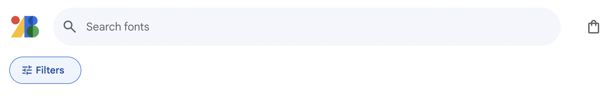
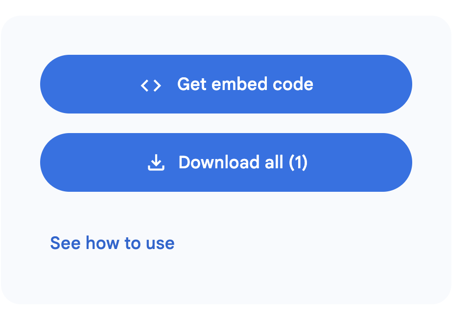
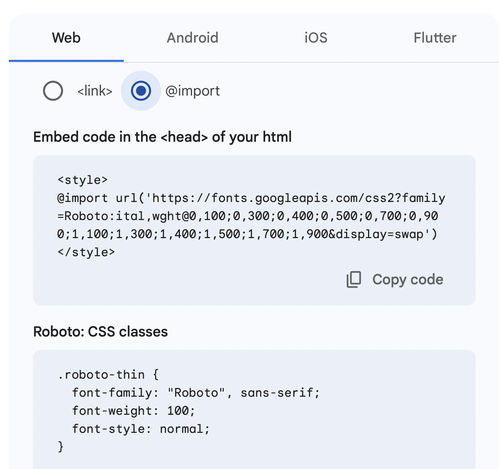
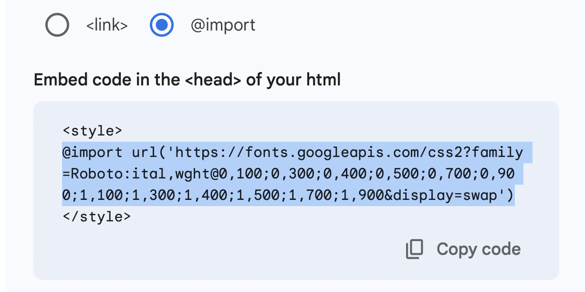
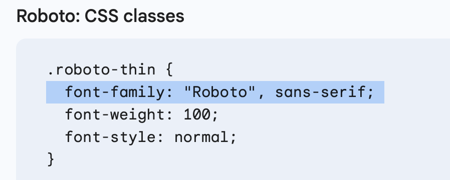

# INFO 1300 > Spring 24 > Activity > Goggle Fonts

In this demo we will walk through how to use goggle fonts.
**Note: you must use the technique outlined here for this class.**

## Resources

- [fonts.goggle.com](https://fonts.google.com/)

## How to use Google Fonts

To use a google font on your website you need to:

1. `@import` the font to make it available in the browser is your CSS file
   (warning: do not use the `<link` technique>)
2. use the appropriate `font-family` property in your CSS file

Lets follow these basic steps to import and use a google font in our Ithaca Zoo example site:

1. Visit [fonts.goggle.com](https://fonts.google.com/)

2. Browse the fonts and find the one you want to use

    Here to will see > 1000 custom fonts that are available to you.
    Browse the list to find one you would like to try or you can search for the font name of you know the font you are looking for.

    You can also select the `filters` button at top right and use that to select the decroative stroke type and a few other options.  Explore those options.

    

    Once you have id'ed the font you want we select the font.

3. Select the font you want to use

    Lets select the font Roboto

    You can search for it or go here 

    To get the code to use this font select the `Get font` button at the bottom of the page.

        

    This then allows you access to get the embed code snippets.

        

4.  Get the Code snippets to add to your CSS file

    Select the `Get embed code` button.  This will provide the 2 snippets you need to import the font and then apply the font on your page.

        

    SPECIAL NOTE:  Notice at the top there are 2 options:  `<link>` and `@import`
    We ALWAYS want to select the `@import` option (for this class.)
    No not use the `<link>` option.

5. Get the  `@import` snippet and add to the top of your CSS file

    Select the `@import` option.  And copy the code snippet:

    SPECIAL NOTE:  This snipped has a `` we do not need this part.
    Only select the `@import` portion.

        

    This `@import` (without the `<style.` tags>) goes at the top of your CSS file.
    You need to `@import` the font before you can use it.

6.  Get the `font-family' snippet and apply it to the an element in your CSS file

    SPECIAL NOTE:  Google fonts provides example classes for using all the variations for the font.  We only need the 1 line from 1 of the classes for the `font-family` property.

    

    Copy and paste this `font-family` snippet and apply it to an element in your CSS file.
